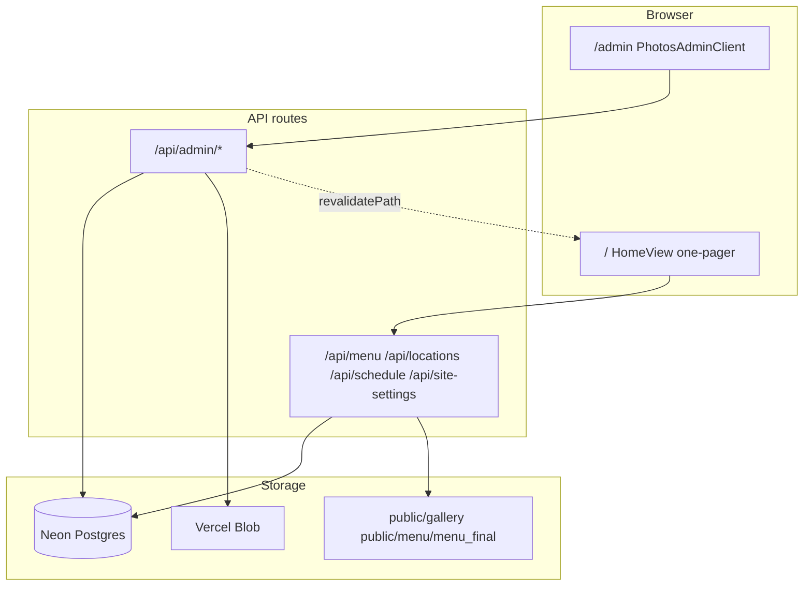

# Angie’s admin portal — full reference

Everything related to **`https://angieskc.com/admin`**: how to sign in, what each tab does, which APIs and database tables power the live site, what works today, what’s broken, and the planned rebuild.

**Related:** [UNIFIED-ADMIN-PLAN.md](./UNIFIED-ADMIN-PLAN.md) — the plan to replace tabs with one scrollable editor.

---

## Quick links

| Item | Location |
|------|----------|
| Admin UI (production) | `https://angieskc.com/admin` |
| Admin page (code) | [`app/admin/page.tsx`](../app/admin/page.tsx) |
| Admin shell (client) | [`components/admin/PhotosAdminClient.tsx`](../components/admin/PhotosAdminClient.tsx) |
| Auth gate (all admin APIs) | [`lib/admin/require-admin-gate.ts`](../lib/admin/require-admin-gate.ts) |
| Env template | [`.env.example`](../.env.example) |

---

## How the admin fits the live site



**Important:** Pushing code to GitHub / Vercel **does not** change menu prices or truck location on the live site. Visitors read **Postgres** when `SITE_DATA_SOURCE=database`. You must **save in admin** or **import menu JSON** into the database.

---

## Authentication

| Detail | Value |
|--------|--------|
| URL | `/admin` (also `/admin/photos` → redirects to `/admin?tab=photos`) |
| Password env | `ADMIN_PHOTOS_PASSWORD` (required for any admin use) |
| Session cookie | `angies_admin_photos` (7-day signed HMAC token) |
| Optional secret | `ADMIN_SESSION_SECRET` (defaults to password if unset) |
| Implementation | [`lib/admin/session.ts`](../lib/admin/session.ts) |
| Login | `POST /api/admin/auth/login` `{ "password": "..." }` |
| Logout | `POST /api/admin/auth/logout` |
| Gate | Every `/api/admin/*` route calls `requireAdminGate()` → 401 or 503 |

Admin is **not indexed** (`robots` / layout metadata on [`app/admin/layout.tsx`](../app/admin/layout.tsx)).

---

## Environment variables

| Variable | Required for | Effect if missing |
|----------|----------------|-------------------|
| `ADMIN_PHOTOS_PASSWORD` | Sign-in | Admin returns 503 “not configured” |
| `ADMIN_SESSION_SECRET` | Cookie signing | Falls back to password hash |
| `DATABASE_URL` | Menu, locations, schedule, site settings, photo metadata | 503 on save; photos metadata → `.data/photos.json` (ephemeral on serverless) |
| `SITE_DATA_SOURCE=database` | Public site reads Postgres catalog | Site uses Google Sheet CSV or built-in fallbacks |
| `BLOB_READ_WRITE_TOKEN` | Production image upload | Dev writes to `public/gallery/uploads/`; prod upload fails |

Status banner in admin is built from [`lib/photos/admin-status.ts`](../lib/photos/admin-status.ts) (`getPhotosAdminStatus()`).

---

## Current UI: five tabs

Routing: **`/admin?tab={site|photos|menu|locations|schedule}`**  
Default tab if missing/invalid: **`photos`**.

Nav is defined in [`PhotosAdminClient.tsx`](../components/admin/PhotosAdminClient.tsx).

### Tab: Homepage (`?tab=site`)

| | |
|--|--|
| **Component** | [`SiteSettingsTab.tsx`](../components/admin/SiteSettingsTab.tsx) |
| **API** | `GET` / `PUT` [`/api/admin/site-settings`](../app/api/admin/site-settings/route.ts) |
| **Database** | `site_settings` row `id = 'default'`, JSONB `payload` |
| **Public read** | [`loadSiteSettingsResolved()`](../lib/site-settings/) → [`SiteSettingsProvider`](../context/) → Hero, Prologue, Story |

**Editable today**

- Hero: eyebrow, headline lines, body, CTA button labels, slideshow slides (`src` + `alt`)
- Prologue: title, subtitle
- Story: section kicker/title, two quotes, footer, carousel slides (`src`, `alt`, `kicker`, `line`)

**Pain points**

- Hero/story images are **typed URLs** (`/gallery/truck.png`), not upload buttons.
- Upload works on the **Photos** tab; you copy the URL back manually.
- Save **does work** when `DATABASE_URL` is set; load error usually means DB is not configured on Vercel.

**Not in site settings (hardcoded on public site)**

- Catering section copy ([`CateringSection.tsx`](../components/catering/CateringSection.tsx))
- Social section copy ([`SocialPromoSection.tsx`](../components/social/SocialPromoSection.tsx))
- Contact phone numbers ([`lib/data/locations.ts`](../lib/data/locations.ts))

---

### Tab: Photos (`?tab=photos`)

| | |
|--|--|
| **Component** | Inline in [`PhotosAdminClient.tsx`](../components/admin/PhotosAdminClient.tsx) |
| **API** | [`/api/admin/photos`](../app/api/admin/photos/route.ts), [`/api/admin/photos/[id]`](../app/api/admin/photos/[id]/route.ts) |

**Editable today**

- Upload JPEG/PNG/WebP/GIF (max 12 MB)
- Per photo: `alt_text`, `category`
- Copy public URL to clipboard

**Storage**

- Files: [`putPublicImage()`](../lib/photos/storage.ts) → Vercel Blob key `angies/menu/{timestamp}-{name}` or dev `public/gallery/uploads/`
- Metadata: Postgres `photos` table or `.data/photos.json`

**Limitations**

- No delete endpoint in API today
- No “pick from library” on other tabs (menu/hero)

---

### Tab: Menu (`?tab=menu`)

| | |
|--|--|
| **Component** | [`MenuCatalogTab.tsx`](../components/admin/MenuCatalogTab.tsx) |
| **List API** | `GET` [`/api/admin/menu`](../app/api/admin/menu/route.ts) |
| **CRUD API (legacy only)** | `POST` / `PATCH` / `DELETE` [`/api/admin/menu`](../app/api/admin/menu/route.ts), [`/api/admin/menu/[id]`](../app/api/admin/menu/[id]/route.ts) |

**Production mode: relational catalog**

When `catalog_menu_items` has any rows (`isRelationalMenuCatalogActive()`):

- UI shows **“Edit (disabled)”** and JSON preview of `optionGroups`
- **Cannot** save name/price/image from the form (API returns **409**)
- Changes require **Import menu JSON** or CLI import

**Import APIs**

| Action | Endpoint | Source |
|--------|----------|--------|
| Load bundled menu | `POST /api/admin/menu-import-final` | Server file (see broken path below) |
| Upload JSON file | `POST /api/admin/menu-import` | Request body = raw JSON |
| Seed empty DB | `POST /api/admin/seed-catalog` | Built-in data; **disabled** when relational active |

Importer: [`importMenuFromJsonString()`](../lib/catalog-db/menu-relational-db.ts) — replaces categories, items, modifiers, meat price overrides.

**JSON shape** ([`lib/menu/import-schema.ts`](../lib/menu/import-schema.ts))

- Root: `{ "menu": { "categories": [...], "globalModifiers": { "meats", "sides", "toppings" } } }`
- Per item: `slug`, `name`, `description`, `basePrice`, `requiresMeatSelection`, optional `variantOverrides`
- **No `imageUrl` in JSON** — images mapped by slug via `menuFinalImageForItemSlug()` → `/menu/menu_final/*.png`

**Legacy mode** (`menu_items` table, empty relational)

- Full form: id, name, category, price, description, imageUrl, checkboxes, **optionGroups as JSON textarea**
- Same fields as [`MenuItem`](../lib/menu/schema.ts)

**CLI**

```bash
npm run import:menu -- ./path/to/menu.json
npm run import:menu:final   # points at public/menu/menu_final/menu.json in package.json
```

Script: [`scripts/import-menu.ts`](../scripts/import-menu.ts)

**Known bug**

- Bundled path in code: `public/menu/menu_final/menu.json` (**deleted / moved**)
- Canonical file in repo: `public/menu/menu.json`
- “Load finalized menu.json (site)” may **500** until paths are aligned

---

### Tab: Locations (`?tab=locations`)

| | |
|--|--|
| **Component** | [`LocationsCatalogTab.tsx`](../components/admin/LocationsCatalogTab.tsx) |
| **API** | `GET` `POST` [`/api/admin/locations`](../app/api/admin/locations/route.ts), `PATCH` `DELETE` [`/api/admin/locations/[id]`](../app/api/admin/locations/[id]/route.ts) |
| **Extra** | `POST` [`/api/admin/geocode`](../app/api/admin/geocode/route.ts) — fill lat/lng from address |
| **Database** | `location_items` |
| **Public** | `GET /api/locations` → [`LocationsSection`](../components/locations/LocationsSection.tsx) |

**Editable today**

- Name, label, address, city, state, zip, hours, phone, email
- Status, status note, maps URL, embed URL, lat/lng, sort order, active flag

Works with relational + `SITE_DATA_SOURCE=database`.

---

### Tab: Schedule (`?tab=schedule`)

| | |
|--|--|
| **Component** | [`ScheduleCatalogTab.tsx`](../components/admin/ScheduleCatalogTab.tsx) |
| **API** | `GET` `POST` [`/api/admin/schedule`](../app/api/admin/schedule/route.ts), `PATCH` `DELETE` [`/api/admin/schedule/[id]`](../app/api/admin/schedule/[id]/route.ts) |
| **Database** | `schedule_items` |
| **Public** | `GET /api/schedule` → embedded in [`LocationsSection`](../components/locations/LocationsSection.tsx) (`ScheduleListBlock`) |

**Editable today**

- Date, start/end time, title, location name, address, status, description, featured, timezone, etc.

---

## Admin API reference

All routes require admin cookie unless noted.

### Auth

| Method | Path | Body | Response |
|--------|------|------|----------|
| POST | `/api/admin/auth/login` | `{ password }` | Sets cookie |
| POST | `/api/admin/auth/logout` | — | Clears cookie |

### Site settings (homepage copy)

| Method | Path | Notes |
|--------|------|-------|
| GET | `/api/admin/site-settings` | `{ ok, merged: SiteSettingsResolved }` |
| PUT | `/api/admin/site-settings` | Full `SiteSettingsResolved` JSON body |

### Photos

| Method | Path | Notes |
|--------|------|-------|
| GET | `/api/admin/photos` | `{ ok, photos: PhotoRecord[] }` |
| POST | `/api/admin/photos` | `multipart/form-data`: `file`, `alt_text`, `category` |
| PATCH | `/api/admin/photos/[id]` | `{ alt_text?, category? }` |

### Menu (legacy `menu_items`)

| Method | Path | Notes |
|--------|------|-------|
| GET | `/api/admin/menu` | `{ ok, items, catalogSource: "relational" \| "legacy" }` |
| POST | `/api/admin/menu` | Create item — **409 if relational** |
| PATCH | `/api/admin/menu/[id]` | Update — **409 if relational** |
| DELETE | `/api/admin/menu/[id]` | Delete — **409 if relational** |

### Menu import

| Method | Path | Notes |
|--------|------|-------|
| POST | `/api/admin/menu-import` | Raw JSON string body |
| POST | `/api/admin/menu-import-final` | Reads bundled file on server |
| POST | `/api/admin/seed-catalog` | Built-in seed if tables empty |

### Catalog menu (relational) — **not built yet**

Planned in [UNIFIED-ADMIN-PLAN.md](./UNIFIED-ADMIN-PLAN.md):

- `PATCH /api/admin/catalog-menu/items/[slug]`
- `PATCH /api/admin/catalog-menu/modifiers/[id]`
- `PUT /api/admin/catalog-menu/items/[slug]/meat-prices`

### Locations

| Method | Path | Notes |
|--------|------|-------|
| GET | `/api/admin/locations` | List all (incl. inactive for admin) |
| POST | `/api/admin/locations` | Create |
| PATCH | `/api/admin/locations/[id]` | Update |
| DELETE | `/api/admin/locations/[id]` | Delete |
| POST | `/api/admin/geocode` | `{ address, city, state, zip }` → lat/lng |

### Schedule

| Method | Path | Notes |
|--------|------|-------|
| GET | `/api/admin/schedule` | List |
| POST | `/api/admin/schedule` | Create |
| PATCH | `/api/admin/schedule/[id]` | Update |
| DELETE | `/api/admin/schedule/[id]` | Delete |

### Cache invalidation

After menu/locations/schedule/site saves and imports, [`revalidatePublicCatalog()`](../lib/admin/revalidate-public.ts) calls `revalidatePath("/", "layout")`.

---

## Postgres tables (admin-managed)

Defined in [`lib/catalog-db/ensure-tables.ts`](../lib/catalog-db/ensure-tables.ts) and related modules.

| Table | Used for | Admin tab |
|-------|----------|-----------|
| `site_settings` | Hero, prologue, story JSON | Homepage |
| `photos` | Uploaded image metadata | Photos |
| `catalog_menu_categories` | Tacos, Burritos, … | Menu (import) |
| `catalog_menu_items` | 11 dishes, prices, images | Menu (import; edit blocked) |
| `catalog_menu_modifiers` | Meats, sides, toppings | Menu (import only) |
| `catalog_menu_item_meat_prices` | Per-item meat overrides | Menu (import only) |
| `menu_items` | Legacy flat menu | Menu (if relational empty) |
| `location_items` | Truck pin, hours, map | Locations |
| `schedule_items` | Upcoming dates | Schedule |

---

## Public APIs (read-only for visitors)

| Path | Data |
|------|------|
| `GET /api/menu` | Menu items + option groups (from relational or legacy) |
| `GET /api/locations` | Active locations |
| `GET /api/schedule` | Active schedule rows |
| `GET /api/site-settings` | Merged homepage settings |

Source selection: [`lib/catalog-db/config.ts`](../lib/catalog-db/config.ts) (`SITE_DATA_SOURCE=database`).

---

## What maps to which homepage section

Public order in [`HomeView.tsx`](../components/home/HomeView.tsx):

| # | Public section | Admin today | Editable without code? |
|---|----------------|-------------|-------------------------|
| 1 | Hero | Homepage tab | Copy yes; images via URL only |
| 2 | Prologue | Homepage tab | Yes |
| 3 | Story | Homepage tab | Copy yes; images via URL only |
| 4 | Menu | Menu tab | **Import only** (relational) |
| 5 | Locations + map + schedule | Locations + Schedule tabs | Yes |
| 6 | Social | — | **No** (hardcoded) |
| 7 | Catering | — | **No** (hardcoded) |
| 8 | Footer / order | Order drawer, Clover | Partial (not site_settings) |

---

## File index (admin-related)

### Routes

```
app/admin/page.tsx
app/admin/layout.tsx
app/admin/photos/page.tsx          → redirect ?tab=photos
app/api/admin/auth/login/route.ts
app/api/admin/auth/logout/route.ts
app/api/admin/site-settings/route.ts
app/api/admin/photos/route.ts
app/api/admin/photos/[id]/route.ts
app/api/admin/menu/route.ts
app/api/admin/menu/[id]/route.ts
app/api/admin/menu-import/route.ts
app/api/admin/menu-import-final/route.ts
app/api/admin/seed-catalog/route.ts
app/api/admin/locations/route.ts
app/api/admin/locations/[id]/route.ts
app/api/admin/schedule/route.ts
app/api/admin/schedule/[id]/route.ts
app/api/admin/geocode/route.ts
```

### UI components

```
components/admin/PhotosAdminClient.tsx    # shell + tabs + photos upload
components/admin/SiteSettingsTab.tsx
components/admin/MenuCatalogTab.tsx
components/admin/LocationsCatalogTab.tsx
components/admin/ScheduleCatalogTab.tsx
```

### Libraries

```
lib/admin/session.ts
lib/admin/require-admin-gate.ts
lib/admin/revalidate-public.ts
lib/admin/parse-menu-body.ts
lib/admin/parse-location-body.ts
lib/admin/parse-schedule-body.ts
lib/photos/storage.ts
lib/photos/repository.ts
lib/photos/admin-status.ts
lib/catalog-db/menu-relational-db.ts
lib/catalog-db/menu-db.ts
lib/site-settings/db.ts
lib/site-settings/types.ts
lib/site-settings/coalesce.ts
lib/menu/import-schema.ts
```

---

## Common workflows

### Update live menu prices (production)

1. Ensure Vercel has `DATABASE_URL` + `SITE_DATA_SOURCE=database`.
2. Sign in to `/admin` → **Menu**.
3. Either fix bundled path and click **Load finalized menu.json**, or upload `menu.json` → **Import JSON**.
4. Confirm `https://angieskc.com/api/menu` shows new prices.

### Change hero slideshow

1. **Photos** tab → upload images → copy URL.
2. **Homepage** tab → paste into slide **Image URL** → **Save homepage content**.
3. Refresh home page.

### Update truck location for today

1. **Locations** tab → select truck → edit status/address/hours → Save.
2. Optional: **Geocode** for map pin.

### Add a schedule date

1. **Schedule** tab → New → fill date/times/location → Save.

---

## Known issues (current)

1. **Menu form read-only** when relational DB is populated (409 on PATCH).
2. **Bundled menu import path** wrong (`menu_final/menu.json` vs `public/menu/menu.json`).
3. **Hero/menu images** require manual URLs; no attach-photo on Homepage/Menu tabs.
4. **Five tabs** hide that the public site is one page; content is split across tabs.
5. **Catering / social** not in admin at all.
6. **Git deploy ≠ data deploy** — easy to think pushing code updates the menu.

---

## Planned rebuild

See **[UNIFIED-ADMIN-PLAN.md](./UNIFIED-ADMIN-PLAN.md)** for:

- Single `/admin` scroll page (no tabs), matching public section order
- `ImageAttachField` (upload + library picker) on hero, story, menu items
- Relational menu PATCH APIs + modifier tables in UI
- Catering/social added to `site_settings`
- JSON import moved to “Advanced” drawer only

---

## Production checklist (angieskc.com)

- [ ] `ADMIN_PHOTOS_PASSWORD` set on Vercel
- [ ] `DATABASE_URL` (Neon) set
- [ ] `SITE_DATA_SOURCE=database`
- [ ] `BLOB_READ_WRITE_TOKEN` for uploads
- [ ] Menu imported at least once (`catalog_menu_items` populated)
- [ ] After admin edits, spot-check `/api/menu`, `/api/locations`, home page refresh
