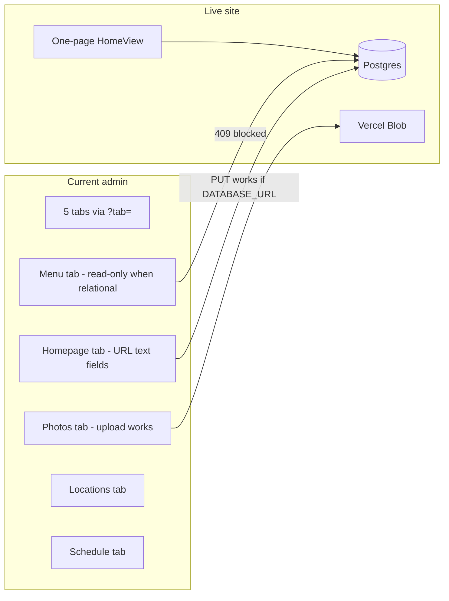
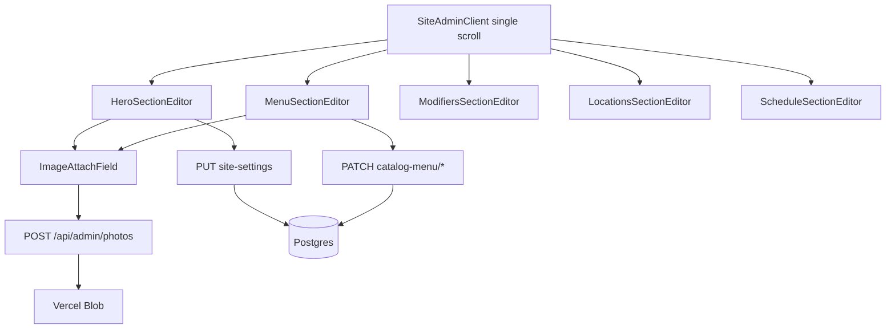

# Unified one-page admin (edit everything)

**Overview:** Replace the tabbed admin with a single scrollable page that mirrors the public one-pager. Every live-editable surface (hero, story, menu items, modifiers, locations, schedule, photos) gets simple forms with attach-photo uploads—not JSON typing or read-only relational blocks.

## Implementation todos

- [ ] Add `ImageAttachField` (upload + library picker) using `POST /api/admin/photos`
- [ ] Replace `PhotosAdminClient` tabs with `SiteAdminClient` single-page + anchor nav + env banner
- [ ] Hero / Prologue / Story / Catering / Social section editors with `ImageAttach` on slides; extend `site_settings` schema
- [ ] Add PATCH routes + dbUpdate helpers for `catalog_menu_items`, modifiers, meat price overrides
- [ ] `MenuSectionEditor` + `ModifiersSectionEditor` (forms, no JSON); collapse JSON import to advanced drawer
- [ ] Embed `LocationsCatalogTab` and `ScheduleCatalogTab` as anchored sections
- [ ] Align `menu-import-final` and image paths with `public/menu/menu.json`
- [ ] Read catering/social copy from site settings on public components; verify deploy env vars

---

## Problem today



- **Menu form already exists** in `components/admin/MenuCatalogTab.tsx` (name, price, description, imageUrl) but is **disabled** when relational catalog is active (`app/api/admin/menu/[id]/route.ts` returns 409).
- **Homepage tab save works** via `PUT /api/admin/site-settings` → Postgres `site_settings` — if you see load/save errors, `DATABASE_URL` is missing on Vercel (503).
- **Hero slides** only accept typed URLs in `components/admin/SiteSettingsTab.tsx`; upload already works on the Photos tab via `POST /api/admin/photos` + `lib/photos/storage.ts`.
- **Bundled import path is broken**: code still points at `public/menu/menu_final/menu.json` but canonical file is `public/menu/menu.json`.

---

## Target experience

One route: **`/admin`** — no tabs. Sticky section nav (anchors) matching public page order:

| Section (anchor) | What you edit | API |
| ---------------- | ------------- | --- |
| `#hero` | Eyebrow, headlines, body, CTA labels, **hero slides (upload)** | `PUT /api/admin/site-settings` |
| `#prologue` | Title, subtitle | same |
| `#story` | Kicker, title, quotes, **story slides (upload)** | same |
| `#menu` | All 11 items: name, price, description, **photo**, requires-meat | **new** relational PATCH |
| `#modifiers` | All meats / sides / toppings + prices; per-item meat overrides | **new** modifier APIs |
| `#locations` | Truck location, hours, status, map pin, geocode | existing `/api/admin/locations` |
| `#schedule` | Upcoming dates | existing `/api/admin/schedule` |
| `#catering` | Section copy (kicker, title, body) | extend `site_settings` |
| `#social` | Section copy + handles | extend `site_settings` |
| `#photos` | General image library (optional, bottom) | existing photos API |

**Bulk JSON import** moves to a collapsed “Advanced: import menu JSON” drawer at the bottom of `#menu` — not the primary workflow.



---

## Implementation plan

### 1. Shared `ImageAttachField` component

New `components/admin/ImageAttachField.tsx`:

- Thumbnail preview of current `src`
- **Upload file** → `POST /api/admin/photos` (reuse logic from `PhotosAdminClient.tsx`)
- **Pick from library** → `GET /api/admin/photos` modal/grid
- On success: `onChange(url)` — no manual path typing required
- Works with `/gallery/…`, `/menu/menu_final/…`, and Blob URLs (already allowed in `next.config.ts`)

Use on: hero slides, story slides, menu item photos.

### 2. Replace admin shell (delete tabs)

- New `components/admin/SiteAdminClient.tsx` — login + env status banner + sticky anchor nav + all sections in one `<main>`
- `app/admin/page.tsx`: render `SiteAdminClient` only; drop `?tab=` routing
- Redirect legacy URLs: `/admin?tab=menu` → `/admin#menu`, etc.
- Remove tab buttons from old shell; deprecate `PhotosAdminClient.tsx` (or thin re-export during migration)

**Env banner** at top (always visible when authed):

- `DATABASE_URL` — required for any save
- `BLOB_READ_WRITE_TOKEN` — required for production uploads
- `SITE_DATA_SOURCE=database` — confirms public site reads Postgres

### 3. Site content sections (hero / prologue / story / catering / social)

- Extract fields from `SiteSettingsTab.tsx` into section components; **one Save per section** (or one global Save — prefer per-section success messages).
- Replace hero/story **Image URL** inputs with `ImageAttachField`.
- Extend `lib/site-settings/types.ts` + `coalesce.ts` + defaults with:

```ts
catering: { kicker, title, subtitle, body? }
social: { kicker, title, subtitle, instagramHandle?, facebookHandle? }
```

- Wire `CateringSection.tsx` and `SocialPromoSection.tsx` to `useSiteSettings()` for copy (fallback to current hardcoded strings).

### 4. Menu — enable relational editing (no JSON for daily edits)

**New DB helpers** in `lib/catalog-db/menu-relational-db.ts`:

- `dbUpdateCatalogMenuItem(slug, { name, description, basePrice, requiresMeatSelection, imageUrl, imageAlt, active, featured, sortOrder })`
- `dbUpdateCatalogModifier(id, { name, amount })`
- `dbUpsertItemMeatPrice(itemSlug, meatModifierId, price)` / delete override

**New routes:**

- `PATCH /api/admin/catalog-menu/items/[slug]`
- `PATCH /api/admin/catalog-menu/modifiers/[id]`
- `PUT /api/admin/catalog-menu/items/[slug]/meat-prices` (array of `{ meatSlug, price }`)

Remove 409 blocks from relational checks on these routes (keep JSON import as replace-all).

**Menu section UI** (`MenuSectionEditor`):

- Reuse list + form layout from `MenuCatalogTab.tsx` **without** `optionGroups` JSON textarea
- Fields: name, category (dropdown), price, description, requires meat, featured, active, **ImageAttachField**
- Save → new PATCH route; clear success/error toast
- When item requires meat: inline table of meats with override price (blank = global default)

**Modifiers section UI:**

- Three tables: Meats | Sides | Toppings — editable name + price, Save per row
- Loads from `catalog_menu_modifiers`

### 5. Locations + schedule (lift existing tabs)

- Move `LocationsCatalogTab.tsx` and `ScheduleCatalogTab.tsx` into anchored sections unchanged (APIs already work).
- Keep geocode button on locations.

### 6. Fix paths + import

- Update `menu-import-final/route.ts`, `package.json` `import:menu:final`, and `menuFinalImageForItemSlug` to use `public/menu/menu.json` and existing `menu_final` image files under `/menu/menu_final/`.

### 7. What we are NOT doing in v1

- **Live WYSIWYG iframe** of `HomeView` with click-to-edit — section forms achieve “one page like the site” without embedding the public layout.
- **Deleting and recreating every admin file from scratch** — replace the shell and wire existing APIs; reuse proven form code from current tabs.

---

## Files touched (primary)

| Action | File |
| ------ | ---- |
| New | `components/admin/SiteAdminClient.tsx`, `ImageAttachField.tsx`, `MenuSectionEditor.tsx`, `ModifiersSectionEditor.tsx`, section wrappers |
| New | `app/api/admin/catalog-menu/items/[slug]/route.ts`, `modifiers/[id]/route.ts`, meat-prices route |
| Extend | `lib/catalog-db/menu-relational-db.ts`, `lib/site-settings/*` |
| Update | `app/admin/page.tsx`, `components/catering/CateringSection.tsx`, `components/social/SocialPromoSection.tsx` |
| Remove tab UX | `PhotosAdminClient.tsx` tab nav (replaced by SiteAdminClient) |

---

## Deploy checklist

After merge, verify on production admin:

1. Banner shows green for `DATABASE_URL` + `BLOB_READ_WRITE_TOKEN`
2. Upload hero slide → Save hero → refresh home → slide appears
3. Edit Quesadilla price → Save → `/api/menu` reflects change
4. Edit Barbacoa +$0.50 in modifiers → options modal shows new price

---

## Success criteria

- No tabs; one scrollable admin matching site section order
- Zero JSON typing for normal menu/hero edits
- All 11 menu items + all modifiers + locations + schedule + homepage copy save via API
- Photos attached by upload/pick, not filename typing
