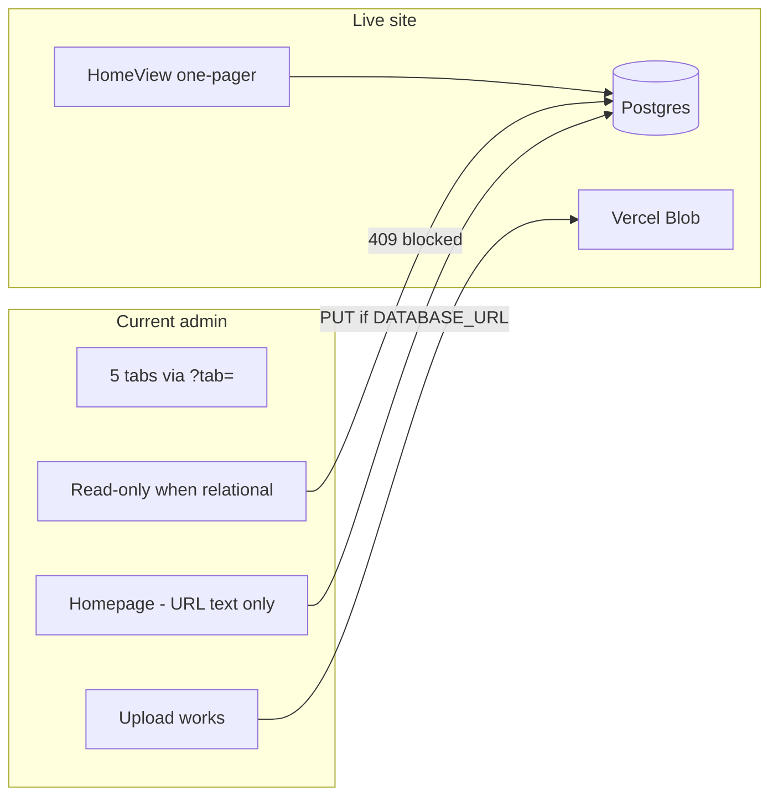
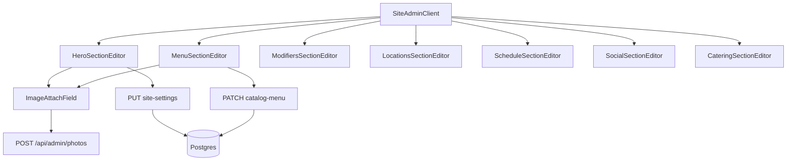

# Unified one-page admin (edit everything)

**Owner direction:** [ANGIES-ADMIN-AGENT-DIRECTION.md](./ANGIES-ADMIN-AGENT-DIRECTION.md)  
**Current admin reference:** [ADMIN-PORTAL.md](./ADMIN-PORTAL.md)

**Overview:** Clone the public homepage into `/admin`, make each section editable, save through the **same APIs and tables** the site already reads. No separate CMS, no tabs, no JSON for daily edits.

## Core principle

```
Public section  →  Admin section  →  Save API  →  Postgres / Blob  →  HomeView reads it
```

The homepage, database, and most APIs already exist. Fill gaps: **relational menu PATCH**, **site_settings for social/catering**, **ImageAttachField**.

---

## Implementation todos

- [ ] Add `ImageAttachField` (upload + library picker) — props per agent direction
- [ ] Add `SiteAdminClient`; point `app/admin/page.tsx` at it; legacy `?tab=` → `#anchors`
- [ ] Section editors in **HomeView order**: Hero, Prologue, Story, Menu, Modifiers, Locations, Schedule, Social, Catering, Photos
- [ ] Extend `site_settings` (social + catering); wire public components
- [ ] Relational PATCH APIs + `dbUpdate*` helpers (items, modifiers, meat prices)
- [ ] `MenuSectionEditor` + `ModifiersSectionEditor`; JSON import under Advanced only
- [ ] Fix `menu-import-final` path → `public/menu/menu.json`
- [ ] Verify saves → `/api/menu`, `/api/site-settings`, revalidate home

---

## Problem today



---

## Target: admin mirrors `HomeView`

Public order in [`components/home/HomeView.tsx`](../components/home/HomeView.tsx):

| # | Public | Admin anchor | Save via |
|---|--------|--------------|----------|
| 1 | Hero | `#hero` | `PUT /api/admin/site-settings` |
| 2 | Prologue | `#prologue` | same |
| 3 | Story | `#story` | same |
| 4 | Menu | `#menu` | `PATCH /api/admin/catalog-menu/items/[slug]` |
| — | (modifiers in modal) | `#modifiers` | `PATCH` modifiers, `PUT` meat-prices |
| 5 | Locations (+ schedule UI) | `#locations` | `/api/admin/locations` |
| — | Schedule list in locations | `#schedule` | `/api/admin/schedule` |
| 6 | Social | `#social` | `site_settings` (new) |
| 7 | Catering | `#catering` | `site_settings` (new) |
| 8 | FinalConversion | — | v2 / optional |
| — | — | `#photos` | `/api/admin/photos` + Advanced JSON |



---

## Implementation plan

### 1. `ImageAttachField`

[`components/admin/ImageAttachField.tsx`](../components/admin/ImageAttachField.tsx):

```ts
type ImageAttachFieldProps = {
  label?: string;
  value: string;
  alt?: string;
  onChange: (url: string) => void;
  onAltChange?: (alt: string) => void;
};
```

- Thumbnail, upload (`POST /api/admin/photos`), pick library (`GET /api/admin/photos`)
- Hero slides, story slides, menu `imageUrl`

### 2. `SiteAdminClient` (replace tabs)

- Login, env banner (`DATABASE_URL`, `BLOB_READ_WRITE_TOKEN`, `SITE_DATA_SOURCE`)
- Sticky nav: Hero · Prologue · Story · Menu · Modifiers · Locations · Schedule · Social · Catering · Photos
- Deprecate tab nav in `PhotosAdminClient`; redirect `?tab=*` to hashes

### 3. Site content (`site_settings`)

Refactor [`SiteSettingsTab.tsx`](../components/admin/SiteSettingsTab.tsx) into section editors with per-section Save.

Extend types:

```ts
catering: { kicker, title, subtitle, body? }
social: { kicker, title, subtitle, body?, instagramHandle?, facebookHandle? }
```

Wire [`CateringSection.tsx`](../components/catering/CateringSection.tsx) and [`SocialPromoSection.tsx`](../components/social/SocialPromoSection.tsx) to `useSiteSettings()` (fallback = current copy).

### 4. Relational menu APIs

In [`lib/catalog-db/menu-relational-db.ts`](../lib/catalog-db/menu-relational-db.ts):

- `dbUpdateCatalogMenuItem(slug, patch)`
- `dbUpdateCatalogModifier(id, patch)`
- `dbUpsertItemMeatPrice` / `dbDeleteItemMeatPrice`

Routes:

- `PATCH /api/admin/catalog-menu/items/[slug]`
- `PATCH /api/admin/catalog-menu/modifiers/[id]`
- `PUT /api/admin/catalog-menu/items/[slug]/meat-prices`

**Item fields:** name, description, basePrice, imageUrl, imageAlt, requiresMeatSelection, active, featured, sortOrder  

**Modifier fields:** name, amount, active, sortOrder  

Legacy `/api/admin/menu/[id]` stays 409 when relational — new routes only.

### 5. Reuse existing UI

| Source | Target |
|--------|--------|
| `SiteSettingsTab` | Hero / Prologue / Story editors |
| `MenuCatalogTab` | `MenuSectionEditor` (no optionGroups JSON main flow) |
| `LocationsCatalogTab` | `#locations` |
| `ScheduleCatalogTab` | `#schedule` |
| Photos upload in `PhotosAdminClient` | `ImageAttachField` + `#photos` library |

### 6. Menu Advanced drawer

Collapsed: **Import menu JSON**, Load bundled `menu.json`, warnings. Not primary workflow.

### 7. Fix bundled menu path

- [`menu-import-final/route.ts`](../app/api/admin/menu-import-final/route.ts) → `public/menu/menu.json`
- `npm run import:menu:final` in [`package.json`](../package.json)

### 8. Not in v1

- Live WYSIWYG iframe / click-to-edit on public `HomeView`
- `FinalConversion` editor (optional v2)
- Rewriting all admin from zero

---

## What NOT to do

See [ANGIES-ADMIN-AGENT-DIRECTION.md](./ANGIES-ADMIN-AGENT-DIRECTION.md#what-not-to-do).

---

## Files touched (primary)

| Action | File |
|--------|------|
| New | `SiteAdminClient.tsx`, `ImageAttachField.tsx`, `*SectionEditor.tsx` |
| New | `app/api/admin/catalog-menu/**` |
| Extend | `menu-relational-db.ts`, `lib/site-settings/*` |
| Update | `app/admin/page.tsx`, `CateringSection`, `SocialPromoSection` |
| Replace | Tab UX in `PhotosAdminClient` |

---

## Deploy checklist

1. Env banner green: `DATABASE_URL`, `BLOB_READ_WRITE_TOKEN`, `SITE_DATA_SOURCE=database`
2. Upload hero slide → Save → home refreshes
3. Edit Quesadilla price → `GET /api/menu` updated
4. Edit Barbacoa modifier → options modal shows new price

---

## Success criteria

- One `/admin` scroll page matching homepage structure
- No tabs; no JSON for normal edits; no manual image paths
- Everything that can change on the public one-pager is editable and persists to the same data sources
